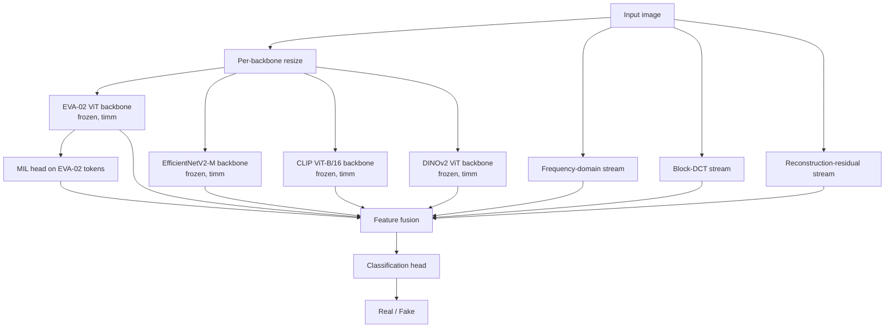
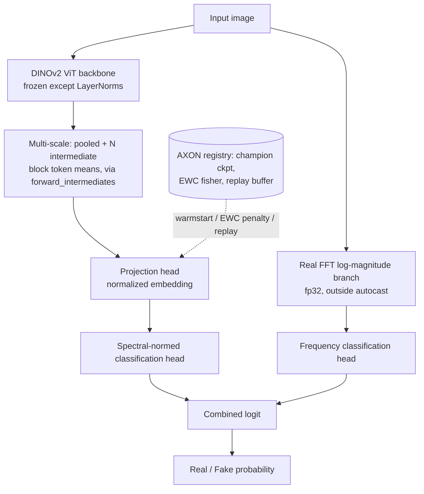

# AXON — Deepfake Detector

A team project (Team AXON) for image deepfake detection. This repo holds two pipelines that share state:

- **`src/axon_sota_v10.py`** — the original four-backbone ensemble (EVA-02, EfficientNetV2-M, CLIP, DINOv2) with handcrafted frequency/DCT/residual streams. See "AXON pipeline" below.
- **`src/phantom_v3.py`** — a newer, single-backbone (DINOv2) pipeline with multi-scale features and a real FFT frequency branch, built to warmstart from and extend AXON's saved state (champion checkpoint, EWC, replay buffer). See "PHANTOM pipeline" below.

## What it does

Classifies images as real or AI-generated/manipulated, trained across multiple public real/fake face and image datasets (e.g. FFHQ, CelebA as real; GAN/diffusion-generated sources as fake). Training runs in rounds on Kaggle, each round resuming from a saved "champion" model state and ledger, so a run can continue evolving across multiple Kaggle sessions rather than restarting from scratch.

## How it works — AXON pipeline (`src/axon_sota_v10.py`)



- Four frozen, pretrained `timm` backbones (EVA-02, EfficientNetV2-M, CLIP ViT-B/16, DINOv2 ViT-B/14) are run per image and their features fused, alongside three handcrafted signal streams (frequency, block-DCT, reconstruction-residual) that target artifacts generative models tend to leave behind.
- A multiple-instance-learning (MIL) head reads the EVA-02 token map directly, rather than only the pooled feature.
- Trained with a combination of focal loss and supervised contrastive loss (SupCon).
- Uses EWC (Elastic Weight Consolidation) and a replay buffer so that retraining on newly added datasets doesn't erase what earlier rounds learned.
- An `EvolutionController`/`Registry` layer tracks the best-AUC "champion" model across rounds and automatically resumes from it on the next run.

## How it works — PHANTOM pipeline (`src/phantom_v3.py`)



- A single DINOv2 backbone (frozen except LayerNorms) with a multi-scale head that aggregates the pooled output and several intermediate transformer blocks in one forward pass.
- A genuine FFT-based frequency branch (log-magnitude spectrum, computed in fp32) feeds its own classification head, combined with the main head's logit.
- Two-stage training: Stage 1 "generalize" (LayerNorms + projection + head trainable), Stage 2 "adapt" (guarded, low learning rate, keeps only epochs that improve the validation score).
- Cross-generator validation split: holds out entire data *sources* (not just random images), so validation AUC reflects generalization to unseen generators rather than memorized images from a seen generator.
- Built to consume AXON's saved state directly: warmstarts from AXON's champion checkpoint, applies an EWC penalty from AXON's Fisher-information file, and merges AXON's replay buffer into its training pool (never into validation).
- Honest-evaluation stage reports bootstrapped 95% CI on AUC, calibration (temperature scaling, ECE before/after), accuracy under an abstention threshold, per-generator AUC, and robustness curves under JPEG recompression and downscaling — plus a built-in train/val near-duplicate leakage check (perceptual hashing) that flags suspiciously high AUC as a possible leakage artifact rather than a win.

## Hardware / Stack

- PyTorch, `timm` (pretrained backbone zoo), scikit-learn (metrics), torchvision (PHANTOM only)
- NumPy, Pillow
- Designed to run as a Kaggle notebook with GPU acceleration (reads from `/kaggle/input`, writes state to `/kaggle/working`); AXON pulls a Hugging Face token from Kaggle Secrets if available for faster backbone downloads

## Setup & Run

### AXON (`src/axon_sota_v10.py`)
Kaggle-notebook-style training script, not a packaged CLI tool.
1. Run in a Kaggle notebook with GPU enabled (the backbones and `USE_BF16`/AMP logic assume CUDA).
2. Provide training data under `/kaggle/input` (real/fake image folders, and/or the CSV-based dataset source configured in `CFG.CSV_DATASETS`).
3. Optionally add an `HF_TOKEN` Kaggle secret for faster Hugging Face backbone downloads.
4. Run the script's `main()`. It looks for a prior AXON state under `/kaggle/input/**/registry/index.json` and resumes from the most-evolved one if found, otherwise starts fresh.

### PHANTOM (`src/phantom_v3.py`)
Has a real CLI, unlike AXON's notebook-style script.
```bash
python phantom_v3.py --smoke-test                                   # fast sanity run, all code paths
python phantom_v3.py --input /data --work /output                   # full training run
python phantom_v3.py --inference image.jpg --ckpt phantom_final.pth # single-image inference
```
Auto-detects an AXON state directory under `--input` (looks for `AXON_LEDGER.json` + `AXON_REPLAY.json`); pass `--axon-state`, `--replay`, `--warmstart`, `--ewc`, and `--ewc-lambda` to point at them explicitly instead.

## Results & Limitations

[TODO: add real benchmark numbers — AUC/accuracy on a held-out set, for AXON and/or PHANTOM — if you're comfortable sharing them, otherwise leave as not yet published.]

PHANTOM's own code flags one thing worth repeating here: a base AUC above 0.999 with low measured leakage on supposedly unseen generators is called out by the script itself as "unusual" and worth double-checking that holdout sources are truly disjoint generators, not a result to take at face value.

## What's next

[TODO: team's actual near-term roadmap for AXON/PHANTOM.]
